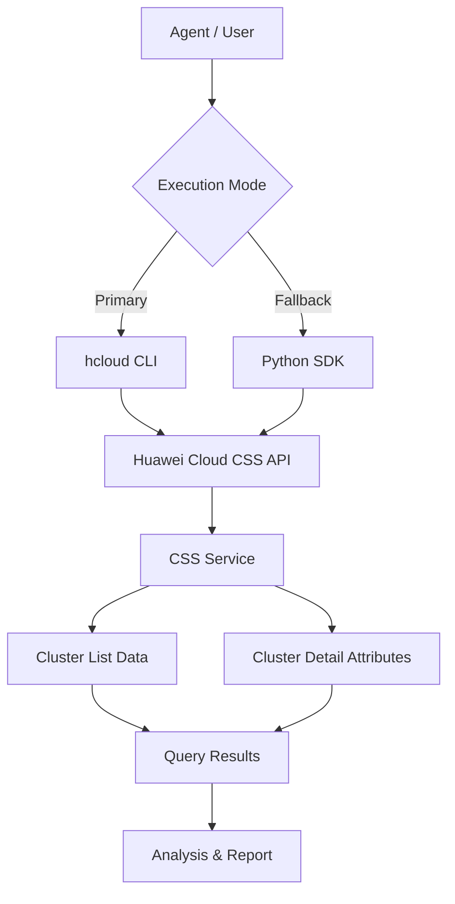

# Data Flow Diagram

## CSS Cluster List Skill Data Flow

## Query Categories

All API paths below are read from the `huaweicloudsdkcss` v1 SDK `_http_info` `resource_path` definitions.

| Category | API Path | Methods |
|----------|----------|---------|
| Cluster List | `/v1.0/{project_id}/clusters` | ListClustersDetails |
