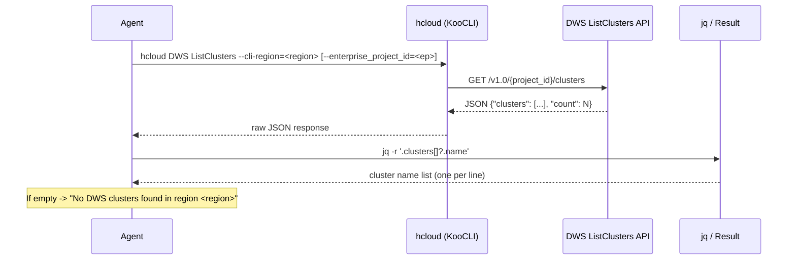

# Data Flow Diagram

```mermaid
sequenceDiagram
    participant Agent
    participant CLI as hcloud (KooCLI)
    participant API as DWS ListClusters API
    participant Output as jq / Result

    Agent->>CLI: hcloud DWS ListClusters --cli-region=<region> [--enterprise_project_id=<ep>]
    CLI->>API: GET /v1.0/{project_id}/clusters
    API-->>CLI: JSON {"clusters": [...], "count": N}
    CLI-->>Agent: raw JSON response
    Agent->>Output: jq -r '.clusters[]?.name'
    Output-->>Agent: cluster name list (one per line)
    Note over Agent: If empty -> "No DWS clusters found in region <region>"
```
