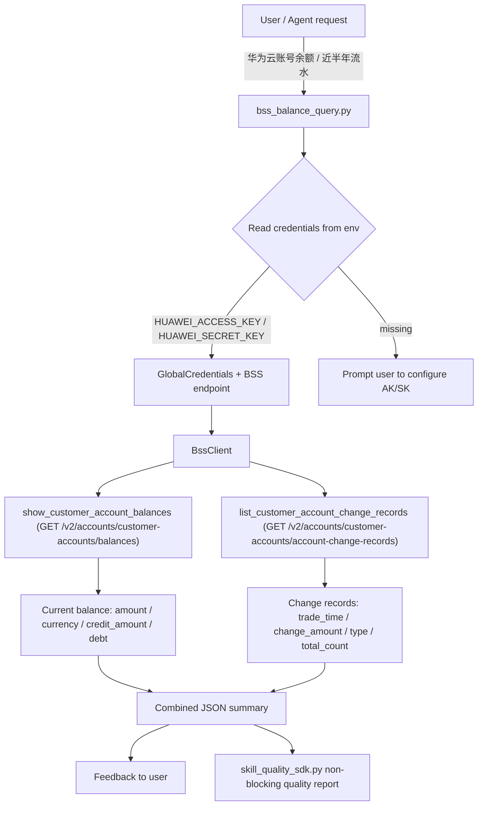

# Data Flow Diagram

## Flow Description

1. The agent receives a request such as "查询华为云账号余额" or "查一下近半年收支明细".
2. `scripts/bss_balance_query.py` loads AK/SK from environment variables
   (`HUAWEI_ACCESS_KEY`/`HUAWEI_SECRET_KEY`, or `HUAWEICLOUD_SDK_AK`/`HUAWEICLOUD_SDK_SK`,
   or `HW_ACCESS_KEY`/`HW_SECRET_KEY`).
3. A BSS client is built with `GlobalCredentials` and the global endpoint
   `https://bss.myhuaweicloud.com` (BSS is a global service).
4. Two read-only calls are made:
   - `show_customer_account_balances` — current account balance (FP-01).
   - `list_customer_account_change_records` — income/expense records in the
     configured window (default last 6 months, FP-02).
5. The combined summary (balance + change records) is returned to the user;
   every run also emits a non-blocking quality report via the vendored
   `scripts/skill_quality_sdk.py`.
