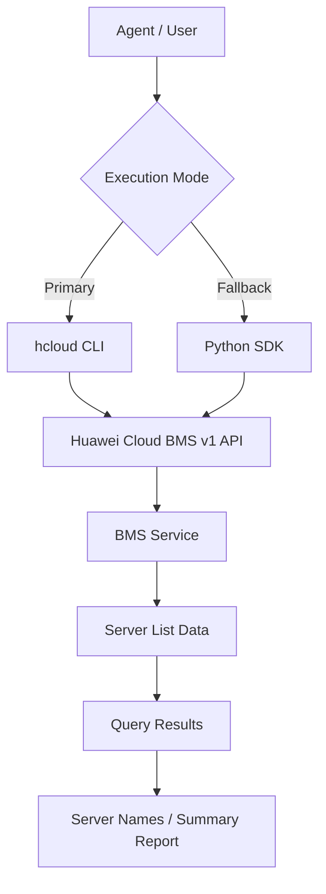

# Data Flow Diagram

## BMS List Skill Data Flow

## API Path

The API path below is read from the `huaweicloudsdkbms` v1 SDK
`_list_bare_metal_servers_http_info` `resource_path` definition.

| Category | API Path | Methods |
|----------|----------|---------|
| Bare Metal Servers (list) | `/v1/{project_id}/baremetalservers/detail` | ListBareMetalServers |
