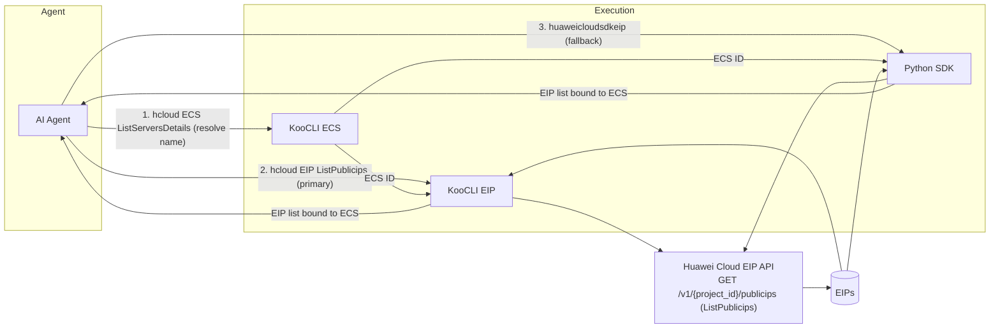
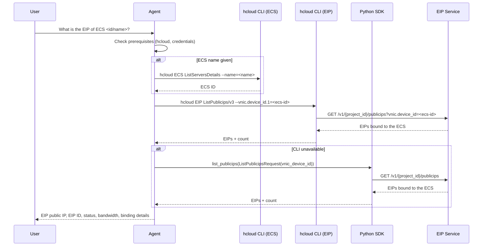
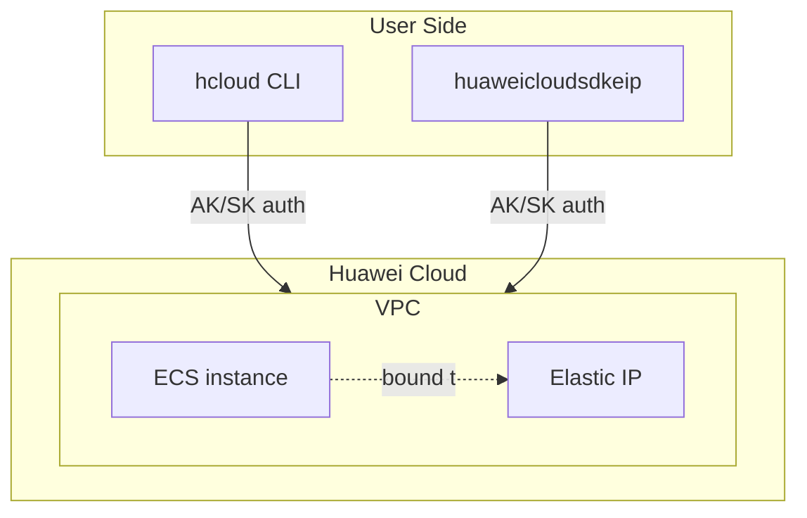

# Data Flow Diagram

## Architecture Overview

## Sequence Diagram

## Deployment Architecture

## Security Notes

- Only read-only operations are invoked: `GET /v1/{project_id}/publicips` (list),
  `GET /v1/{project_id}/publicips/{publicip_id}` (show), `GET /v1/{project_id}/cloudservers/detail` (list servers)
  and `GET /v1/{project_id}/cloudservers/{server_id}` (show server)
- Credentials are never hardcoded in the skill; they come from the user's KooCLI configuration or environment variables
- Least-privilege policies (`vpc:publicIps:list`/`get`, `ecs:servers:list`/`get`) are documented in `references/eip-policies.md`
