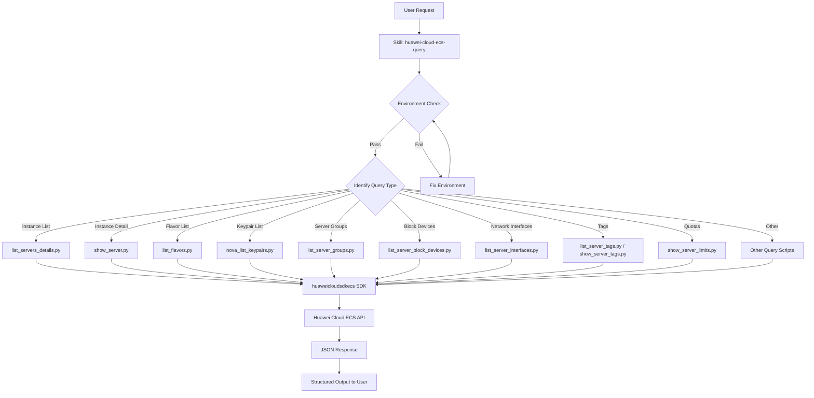

# Data Flow Diagram

## Data Flow Description

1. **User Request** — User provides query intent (e.g., "list all ECS instances")
2. **Skill** — huawei-cloud-ecs-query skill is invoked
3. **Environment Check** — Verify Python, SDK, credentials, and service availability
4. **Identify Query Type** — Match user intent to the appropriate script
5. **Execute Script** — Run the Python query script via `skill action=exec`
6. **SDK Call** — Script calls Huawei Cloud Python SDK (`huaweicloudsdkecs`)
7. **API Request** — SDK sends REST API request to Huawei Cloud ECS service
8. **JSON Response** — API returns JSON response
9. **Structured Output** — Script parses and formats results for user consumption
