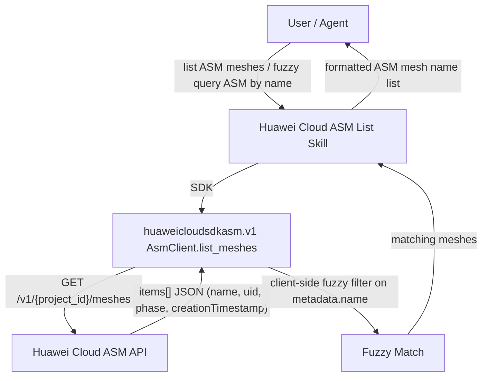

# Dataflow Diagram — huawei-cloud-asm-fuzzy-list

## Request Flow

## Operation Table

| Step | Component | Action |
|------|-----------|--------|
| 1 | User/Agent | Issues a natural-language request to list ASM meshes or fuzzy-match meshes by name |
| 2 | Skill | Parses region + name keyword, builds the SDK client |
| 3 | SDK | `AsmClient.list_meshes(ListMeshesRequest())` — `GET /v1/{project_id}/meshes` |
| 4 | ASM API | Returns all meshes of the project (`items[]`) with name/uid/phase/creationTimestamp |
| 5 | Skill | Applies client-side case-insensitive substring filter on `metadata.name` |
| 6 | Skill | Presents the matched mesh name list and metadata to the user |

## Read-Only Guarantee

Only the `GET /v1/{project_id}/meshes` (list) call is issued. No create,
modify or delete call is ever made by this skill.
