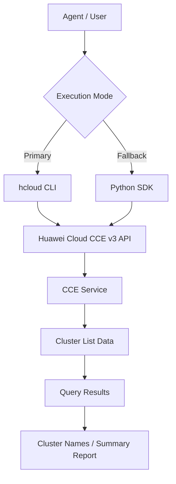

# Data Flow Diagram

## CCE Cluster List Skill Data Flow

## API Path

The API path below is read from the `huaweicloudsdkcce` v3 SDK
`_list_clusters_http_info` `resource_path` definition.

| Category | API Path | Methods |
|----------|----------|---------|
| Clusters (list) | `/api/v3/projects/{project_id}/clusters` | ListClusters |
