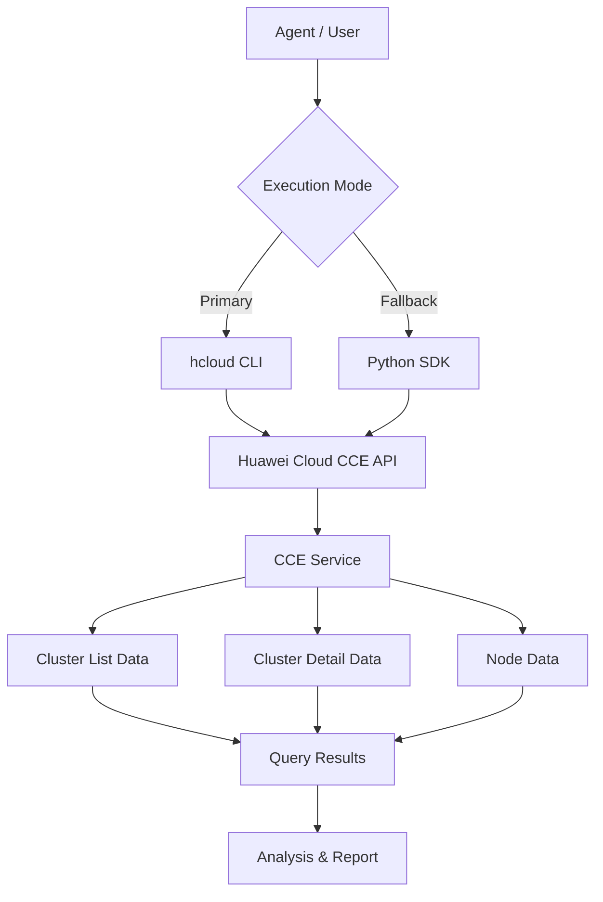

# Data Flow Diagram

## CCE Query Skill Data Flow

## Query Categories

All API paths below are read from the `huaweicloudsdkcce` v3 SDK `_http_info` `resource_path` definitions.

| Category | API Path | Methods |
|----------|----------|---------|
| Clusters | `/api/v3/projects/{project_id}/clusters` | ListClusters |
| Cluster Detail | `/api/v3/projects/{project_id}/clusters/{cluster_id}` | ShowCluster |
| Nodes | `/api/v3/projects/{project_id}/clusters/{cluster_id}/nodes` | ListNodes |
| Node Detail | `/api/v3/projects/{project_id}/clusters/{cluster_id}/nodes/{node_id}` | ShowNode |
