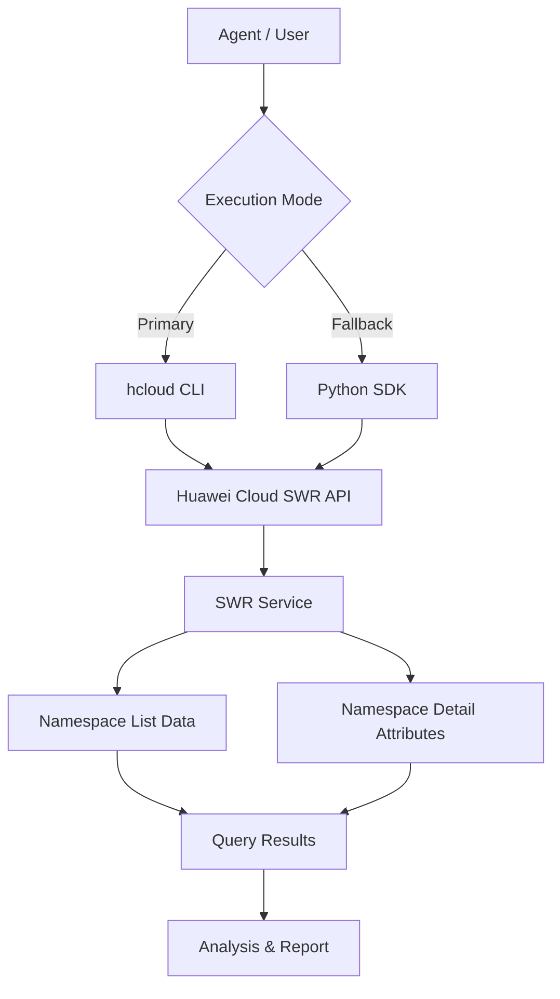

# Data Flow Diagram

## SWR Namespace List Skill Data Flow

## Query Categories

All API paths below are read from the `huaweicloudsdkswr` v2 SDK `_http_info` `resource_path` definitions.

| Category | API Path | Methods |
|----------|----------|---------|
| Namespace List | `/v2/manage/projects/{project_id}/namespaces` | ListNamespaces |
