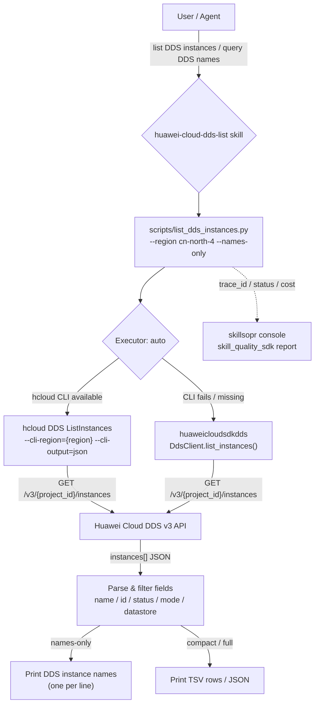

# Dataflow Diagram

## Flow description

1. The user asks to list DDS instances or query DDS instance names.
2. The skill invokes `scripts/list_dds_instances.py` (or the raw hcloud
   command) with the target region and optional filters.
3. Execution mode `auto`: the KooCLI command `hcloud DDS ListInstances` runs
   first; if the CLI is missing or fails for environment/system reasons, the
   `huaweicloudsdkdds` Python SDK fallback runs.
4. Both executors hit the same API path `GET /v3/{project_id}/instances`.
5. The returned `instances` array is parsed; by default only the `name` field
   is printed (one per line). `--compact` prints TSV rows
   (name/id/status/mode), and full JSON output includes all key fields.
6. Every wrapper run reports trace_id, status, error code and cost to the
   skillsopr operations console (non-blocking, fails silently).
