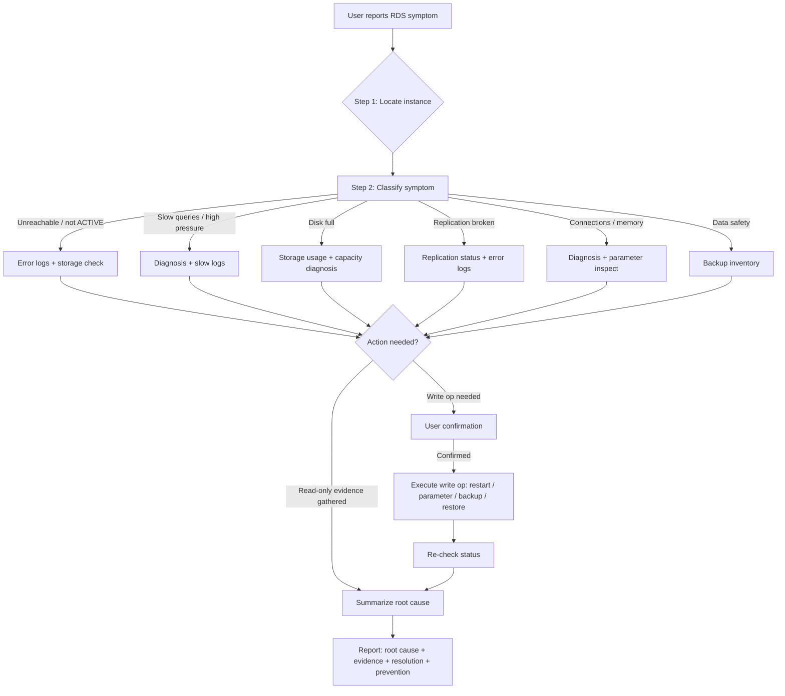
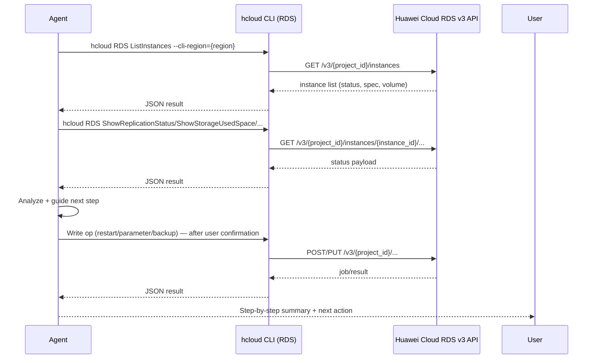
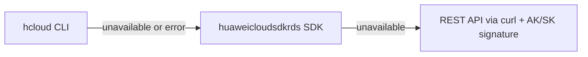

# Dataflow Diagram

## Guided RDS Troubleshooting Flow

```mermaid
flowchart TD
    A[User reports RDS symptom] --> B{Step 1: Locate instance}
    B --> C[Step 2: Classify symptom]
    C -->|Unreachable / not ACTIVE| D[Error logs + storage check]
    C -->|Slow queries / high pressure| E[Diagnosis + slow logs]
    C -->|Disk full| F[Storage usage + capacity diagnosis]
    C -->|Replication broken| G[Replication status + error logs]
    C -->|Connections / memory| H[Diagnosis + parameter inspect]
    C -->|Data safety| I[Backup inventory]
    D --> J{Action needed?}
    E --> J
    F --> J
    G --> J
    H --> J
    I --> J
    J -->|Read-only evidence gathered| K[Summarize root cause]
    J -->|Write op needed| L[User confirmation]
    L -->|Confirmed| M[Execute write op: restart / parameter / backup / restore]
    M --> N[Re-check status]
    N --> K
    K --> O[Report: root cause + evidence + resolution + prevention]
```

## Command Flow (CLI-first)

```mermaid
sequenceDiagram
    participant Agent
    participant KooCLI as hcloud CLI (RDS)
    participant API as Huawei Cloud RDS v3 API
    Agent->>KooCLI: hcloud RDS ListInstances --cli-region={region}
    KooCLI->>API: GET /v3/{project_id}/instances
    API-->>KooCLI: instance list (status, spec, volume)
    KooCLI-->>Agent: JSON result
    Agent->>KooCLI: hcloud RDS ShowReplicationStatus/ShowStorageUsedSpace/...
    KooCLI->>API: GET /v3/{project_id}/instances/{instance_id}/...
    API-->>KooCLI: status payload
    KooCLI-->>Agent: JSON result
    Agent->>Agent: Analyze + guide next step
    Agent->>KooCLI: Write op (restart/parameter/backup) — after user confirmation
    KooCLI->>API: POST/PUT /v3/{project_id}/...
    API-->>KooCLI: job/result
    KooCLI-->>Agent: JSON result
    Agent-->>User: Step-by-step summary + next action
```

## Fallback Chain

```mermaid
flowchart LR
    A[hcloud CLI] -->|unavailable or error| B[huaweicloudsdkrds SDK]
    B -->|unavailable| C[REST API via curl + AK/SK signature]
```
