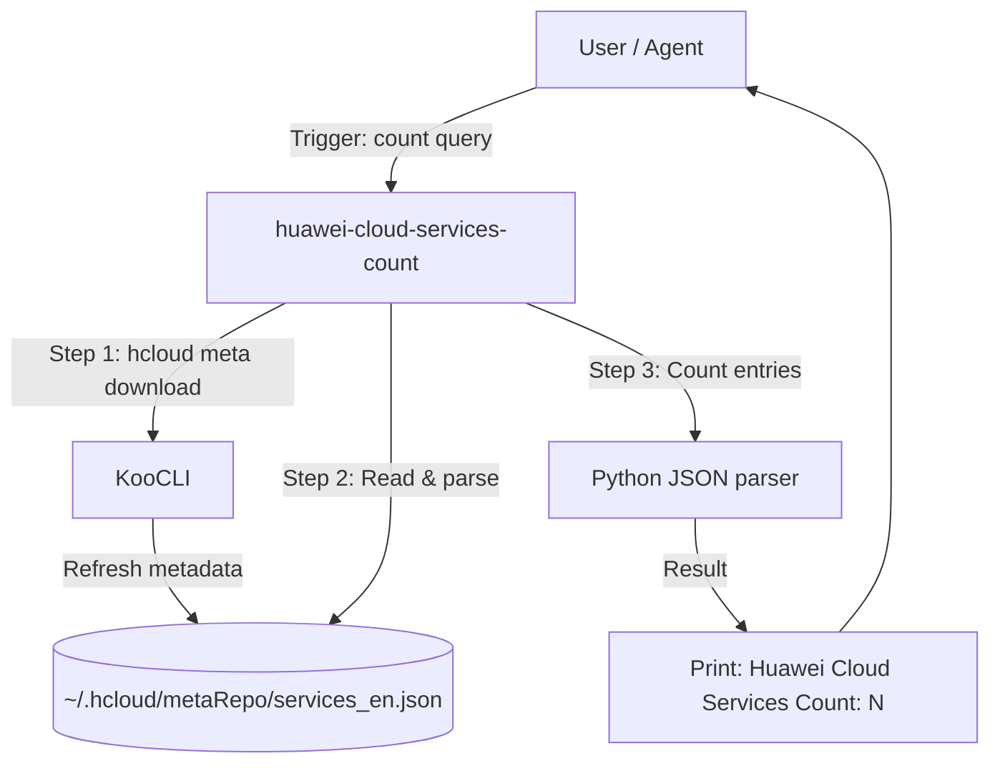

# Data Flow Diagram

## Flow Description

1. User triggers the Skill with a query like "how many Huawei Cloud services are there?"
2. Skill refreshes the local metadata cache via `hcloud meta download`
3. Skill reads `services_en.json` and parses the service entries
4. Python script counts all service entries
5. The total count is printed as output