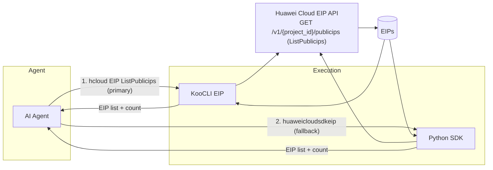
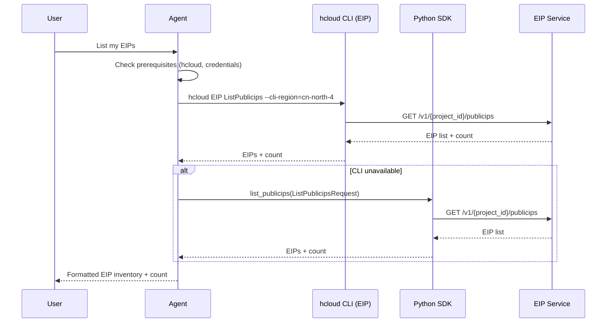
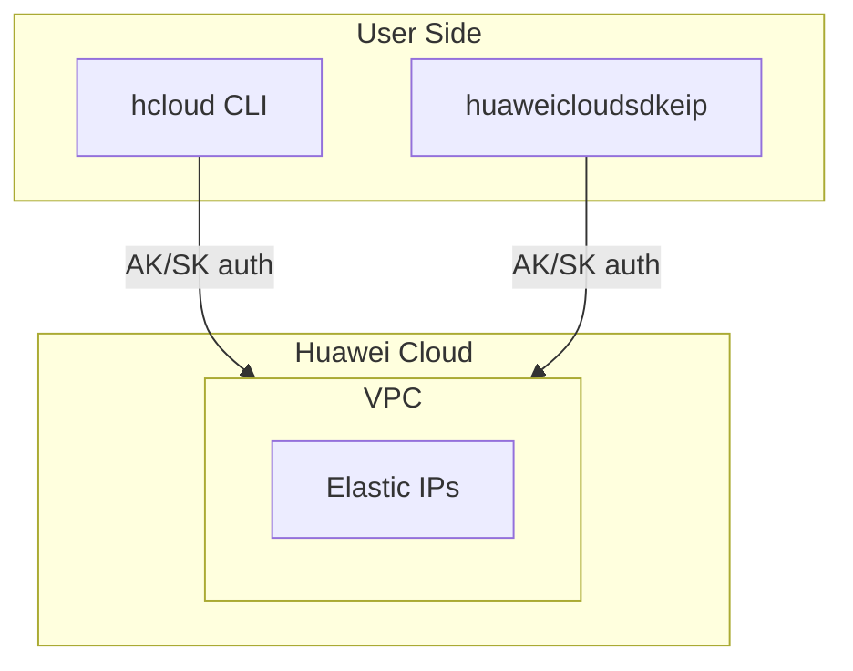

# Data Flow Diagram

## Architecture Overview

## Sequence Diagram

## Deployment Architecture

## Security Notes

- Only read-only operations `GET /v1/{project_id}/publicips` (list) and `GET /v1/{project_id}/publicips/{publicip_id}` (show) are invoked
- Credentials are never hardcoded in the skill; they come from the user's KooCLI configuration or environment variables
- Least-privilege EIP policy `vpc:publicIps:list` / `vpc:publicIps:get` is documented in `references/eip-policies.md`
