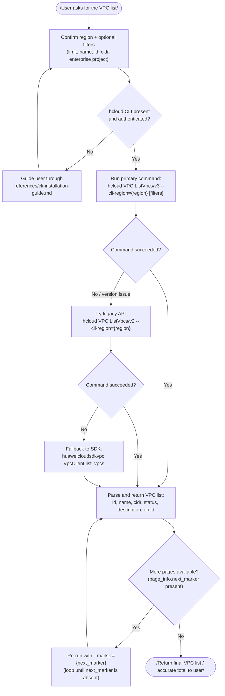

# Data Flow Diagram — huawei-cloud-vpc-list

```mermaid
flowchart TD
  START(["/User asks for the VPC list/"]) --> CONFIRM["Confirm region + optional filters\n(limit, name, id, cidr, enterprise project)"]
  CONFIRM --> PREREQ{"hcloud CLI present\nand authenticated?"}
  PREREQ -->|No| GUIDE["Guide user through\nreferences/cli-installation-guide.md"]
  GUIDE --> CONFIRM
  PREREQ -->|Yes| CLI["Run primary command:\nhcloud VPC ListVpcs/v3 --cli-region={region} [filters]"]
  CLI --> OK{"Command succeeded?"}
  OK -->|Yes| OUTPUT["Parse and return VPC list:\nid, name, cidr, status, description, ep id"]
  OK -->|No / version issue| V2["Try legacy API:\nhcloud VPC ListVpcs/v2 --cli-region={region}"]
  V2 --> OK2{"Command succeeded?"}
  OK2 -->|Yes| OUTPUT
  OK2 -->|No| SDK["Fallback to SDK:\nhuaweicloudsdkvpc VpcClient.list_vpcs"]
  SDK --> OUTPUT
  OUTPUT --> MORE{"More pages available?\n(page_info.next_marker present)"}
  MORE -->|Yes| PAG["Re-run with --marker={next_marker}\n(loop until next_marker is absent)"]
  PAG --> OUTPUT
  MORE -->|No| END(["/Return final VPC list / accurate total to user/"])
```
