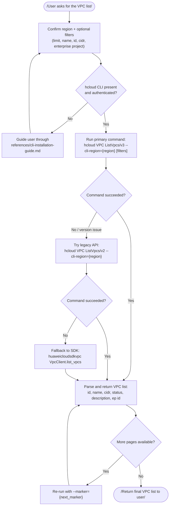

# Data Flow Diagram — huawei-cloud-vpc-list

## Flow Description

1. Confirm the target region and any optional filter parameters with the user.
2. Verify the KooCLI (`hcloud`) is installed and authenticated.
3. Run the primary v3 CLI command; on failure fall back to the v2 CLI command, then to the Python SDK.
4. Parse the returned `vpcs` array and present id/name/cidr/status/description/enterprise-project.
5. If the result set is paginated, fetch the next page using `--marker` until all pages are returned.
6. This skill performs **read-only** queries — no VPC is created, modified, or deleted.
