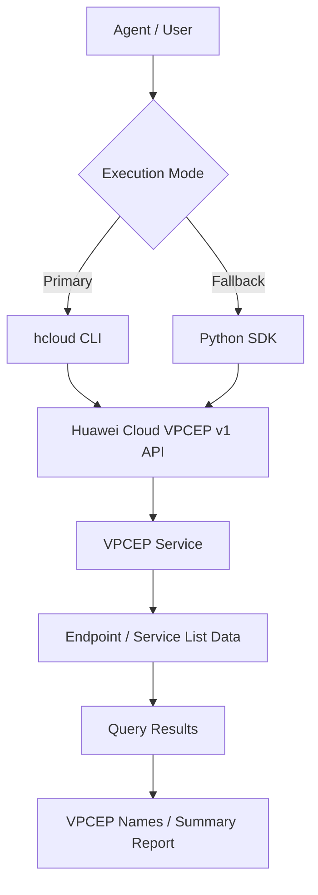

# Data Flow Diagram

## VPCEP List Skill Data Flow

## API Paths

The API paths below are read from the `huaweicloudsdkvpcep` v1 SDK
`_list_endpoints_http_info` / `_list_endpoint_service_http_info`
`resource_path` definitions.

| Category | API Path | Methods |
|----------|----------|---------|
| VPC Endpoint (list) | `/v1/{project_id}/vpc-endpoints` | ListEndpoints |
| VPC Endpoint Service (list) | `/v1/{project_id}/vpc-endpoint-services` | ListEndpointService |
