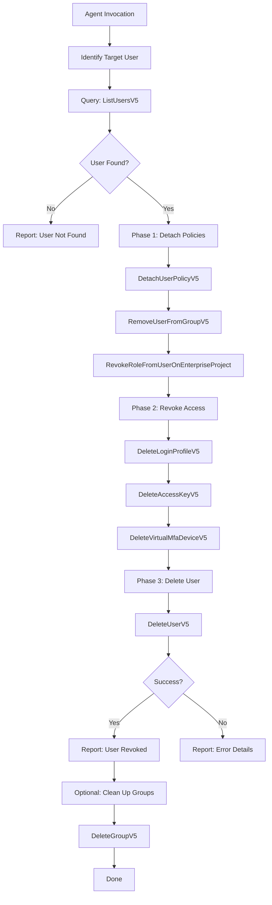

# Data Flow Diagram

## Flow Description

1. **Identify** — List all users or users in a specific group
2. **Detach** — Remove all policies and group memberships from the user
3. **Revoke** — Delete console login, access keys, and MFA devices
4. **Delete** — Remove the IAM user account
5. **Clean up** — Optionally delete empty groups