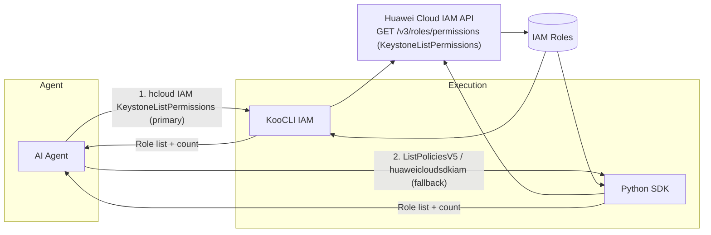
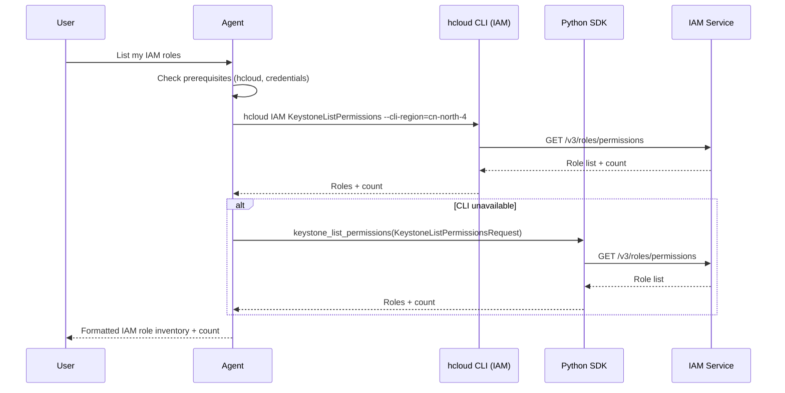
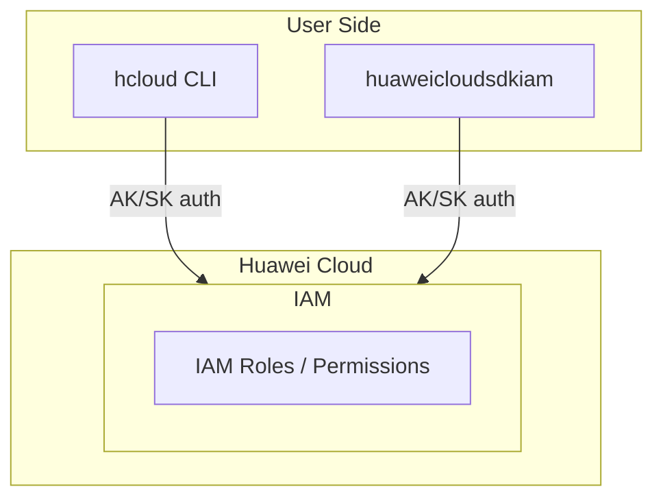

# Data Flow Diagram

## Architecture Overview

## Sequence Diagram

## Deployment Architecture

## Security Notes

- Only read-only operation `GET /v3/roles/permissions` is invoked
- Credentials are never hardcoded in the skill; they come from the user's KooCLI configuration or environment variables
- Least-privilege IAM policy `iam:roles:listRoles` is documented in `references/iam-policies.md`
