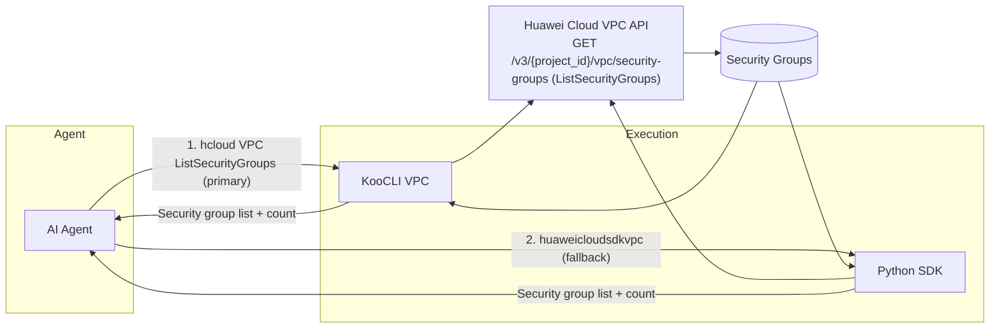
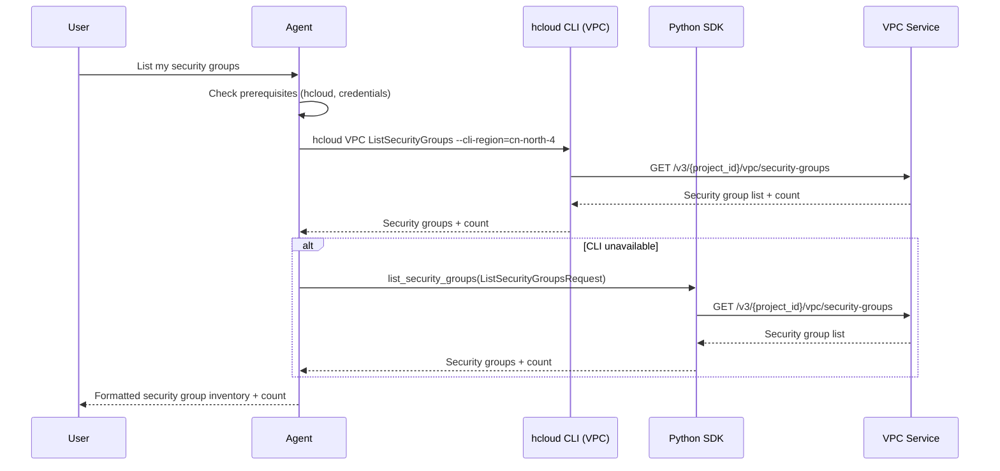
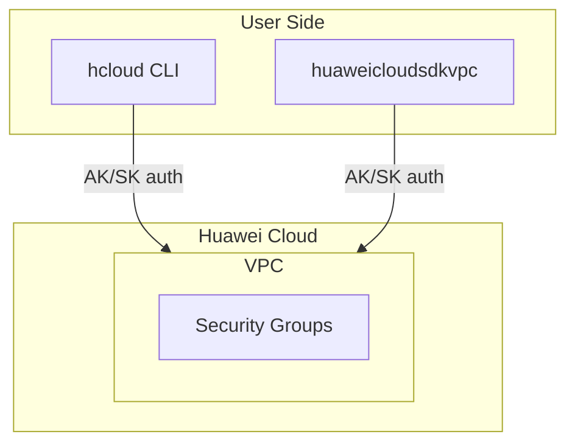

# Data Flow Diagram

## Architecture Overview

## Sequence Diagram

## Deployment Architecture

## Security Notes

- Only read-only operation `GET /v3/{project_id}/vpc/security-groups` is invoked
- Credentials are never hardcoded in the skill; they come from the user's KooCLI configuration or environment variables
- Least-privilege VPC policy `vpc:securityGroups:list` is documented in `references/vpc-policies.md`
