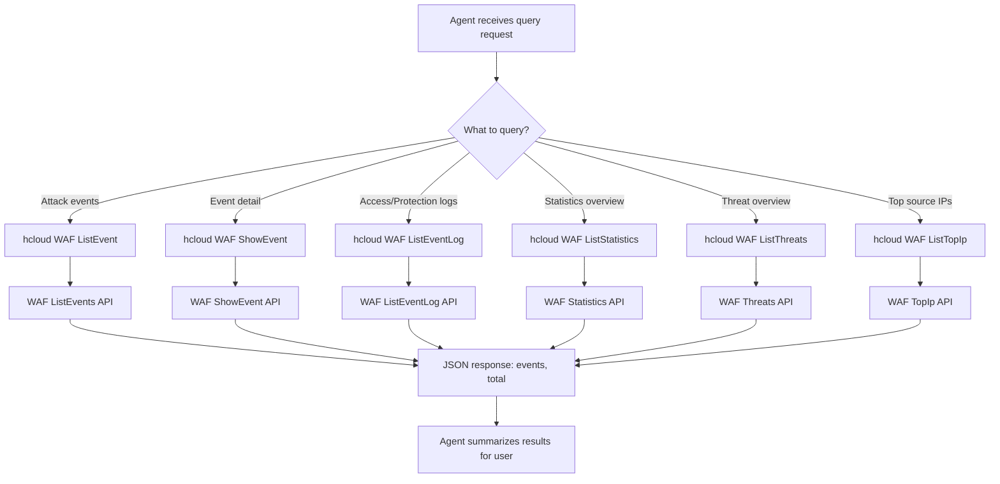

# Data Flow Diagram

## Explanation

1. The agent identifies the query intent (events / detail / logs / statistics / threats / top IPs).
2. It invokes the corresponding read-only `hcloud WAF` command with `--cli-region` and `--project_id`.
3. WAF APIs return JSON; the agent formats the result (counts, top items, event details) for the user.
4. All operations are GET queries — no WAF resources are modified.
