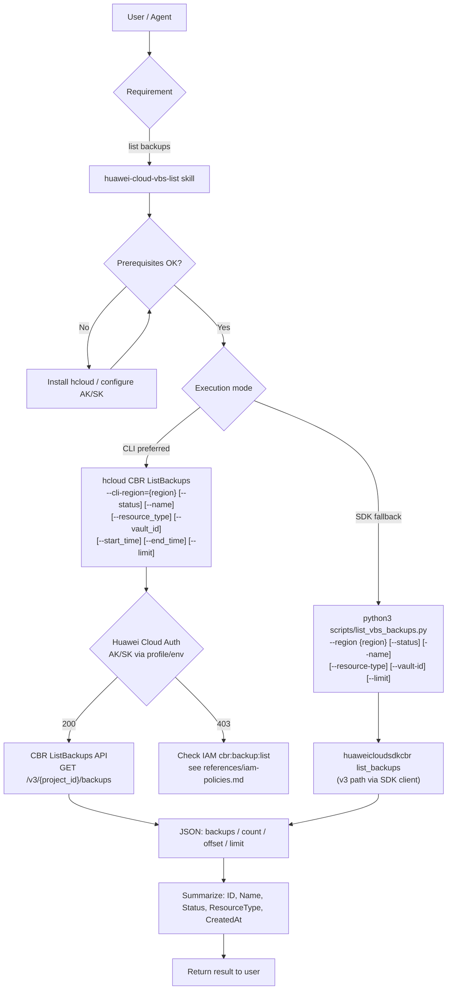

# Data Flow Diagram

## Description

1. The user requests a list of their VBS (Volume Backup Service) backups.
2. The skill verifies the CLI and credentials prerequisites.
3. The skill executes `hcloud CBR ListBackups` (CLI-first). If the CLI is unavailable, it falls back to the CBR SDK (`scripts/list_vbs_backups.py`).
4. Both paths call the real CBR API `GET /v3/{project_id}/backups` (VBS has been merged into CBR).
5. The JSON response is summarized into key fields and returned to the user.
