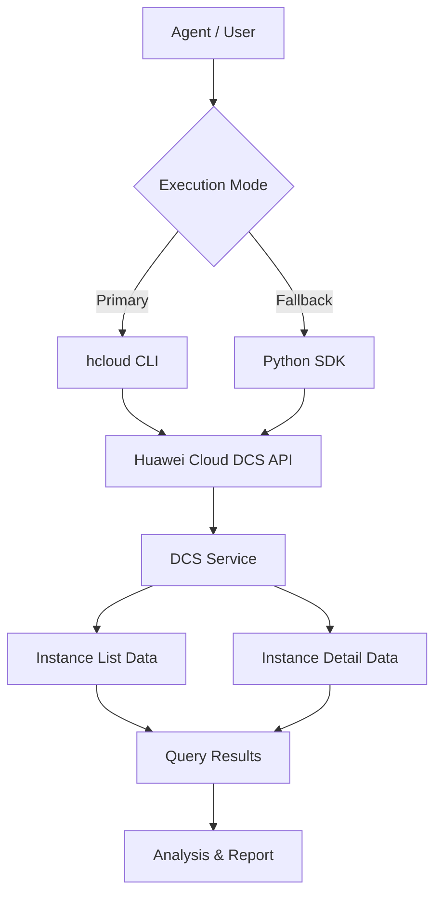

# Data Flow Diagram

## DCS List Skill Data Flow

## Query Categories

All API paths below are read from the `huaweicloudsdkdcs` v2 SDK `_http_info` `resource_path` definitions.

| Category | API Path | Methods |
|----------|----------|---------|
| Instance List | `/v2/{project_id}/instances` | ListInstances |
| Instance Detail | `/v2/{project_id}/instances/{instance_id}` | ShowInstance |
