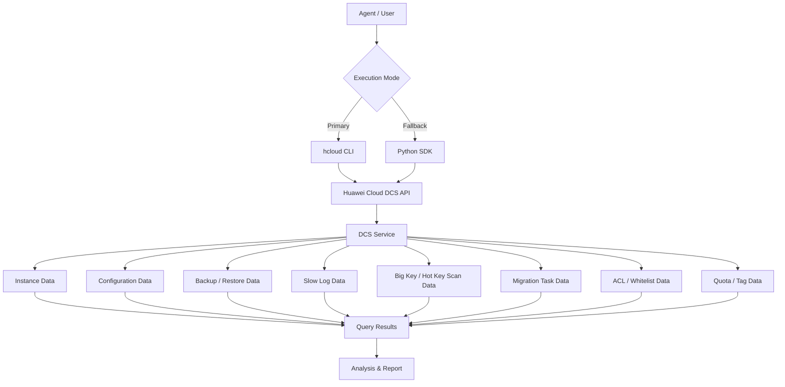

# Data Flow Diagram

## DCS Query Skill Data Flow

## Query Categories

All API paths below are read from the `huaweicloudsdkdcs` v2 SDK `_http_info` `resource_path` definitions.

| Category | API Path | Methods |
|----------|----------|---------|
| Instances | `/v2/{project_id}/instances` | ListInstances |
| Instance Detail | `/v2/{project_id}/instances/{instance_id}` | ShowInstance |
| Instance Status | `/v2/{project_id}/instances/status` | ListNumberOfInstancesInDifferentStatus |
| Instance Statistics | `/v2/{project_id}/instances/statistic` | ListStatisticsOfRunningInstances |
| Availability Zones | `/v2/available-zones` | ListAvailableZones |
| Maintenance Windows | `/v2/instances/maintain-windows` | ListMaintenanceWindows |
| Quota | `/v2/{project_id}/quota` | ShowQuotaOfTenant |
| Replication Groups | `/v2/{project_id}/instance/{instance_id}/groups` | ListGroupReplicationInfo |
| Configurations | `/v2/{project_id}/instances/{instance_id}/configs` | ListConfigurations |
| Config History | `/v2/{project_id}/instances/{instance_id}/config-histories` | ListConfigHistories |
| Backup Records | `/v2/{project_id}/instances/{instance_id}/backups` | ListBackupRecords |
| Restore Records | `/v2/{project_id}/instances/{instance_id}/restores` | ListRestoreRecords |
| Slow Logs | `/v2/{project_id}/instances/{instance_id}/slowlog` | ListSlowlog |
| Redis Logs | `/v2/{project_id}/instances/{instance_id}/redislog` | ListRedislog |
| Big Key Tasks | `/v2/{project_id}/instances/{instance_id}/bigkey-tasks` | ListBigkeyScanTasks, ShowBigkeyAutoscanConfig |
| Hot Key Tasks | `/v2/{project_id}/instances/{instance_id}/hotkey-tasks` | ListHotKeyScanTasks, ShowHotkeyAutoscanConfig |
| Diagnosis Tasks | `/v2/{project_id}/instances/{instance_id}/diagnosis` | ListDiagnosisTasks |
| Migration Tasks | `/v2/{project_id}/migration-tasks` | ListMigrationTask, ShowMigrationTask |
| ACL Accounts | `/v2/{project_id}/instances/{instance_id}/accounts` | ListAclAccounts |
| IP Whitelist | `/v2/{project_id}/instance/{instance_id}/whitelist` | ShowIpWhitelist |
| Tenant Tags | `/v2/{project_id}/dcs/tags` | ListTagsOfTenant |
| Instance Tags | `/v2/{project_id}/instances/{instance_id}/tags` | ShowTags |
