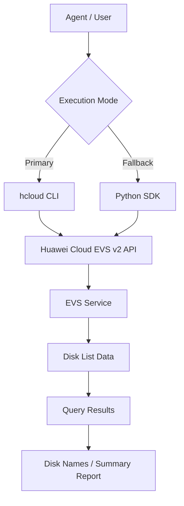

# Data Flow Diagram

## EVS List Skill Data Flow

## API Path

The API path below is read from the `huaweicloudsdkevs` v2 SDK
`_list_volumes_http_info` `resource_path` definition.

| Category | API Path | Methods |
|----------|----------|---------|
| Elastic Volume Service (list) | `/v2/{project_id}/cloudvolumes/detail` | ListVolumes |
