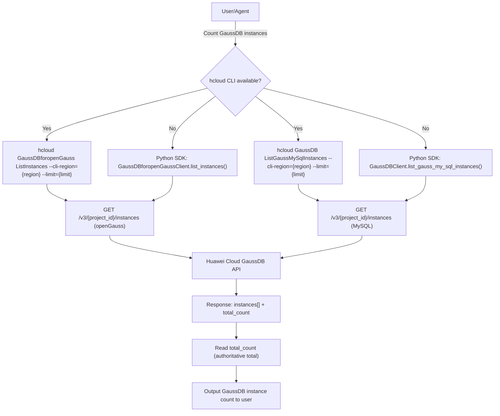

# Data Flow Diagram

## API Endpoint

| Item | Value |
|------|-------|
| Method | `GET` |
| Path | `/v3/{project_id}/instances` (both openGauss and MySQL services) |
| SDK method | `list_instances` (huaweicloudsdkgaussdbforopengauss v3), `list_gauss_my_sql_instances` (huaweicloudsdkgaussdb v3) |
| Source | SDK `_list_instances_http_info` / `_list_gauss_my_sql_instances_http_info` resource_path |
