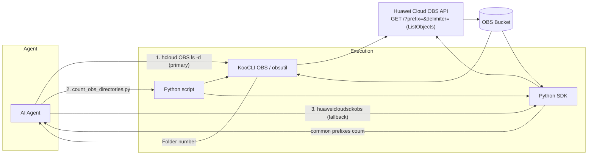

# Data Flow Diagram

## Architecture Overview



## Sequence Diagram

```mermaid
sequenceDiagram
    participant U as User
    participant A as Agent
    participant P as count_obs_directories.py
    participant C as hcloud CLI (obsutil)
    participant S as Python SDK
    participant O as OBS Service

    U->>A: How many directories are in bucket X?
    A->>P: --bucket X
    P->>C: hcloud OBS ls obs://X/ -d
    C->>O: GET /?prefix=&delimiter=/
    O-->>C: common prefixes (directories)
    C-->>P: Folder number: N
    P-->>A: N
    A-->>U: N

    alt CLI unavailable
        A->>P: --bucket X --executor sdk
        P->>S: ListObjectsRequest(prefix, delimiter=/)
        S->>O: GET /?prefix=&delimiter=/
        O-->>S: common prefixes
        S-->>P: count
        P-->>A: N
        A-->>U: N
    end
