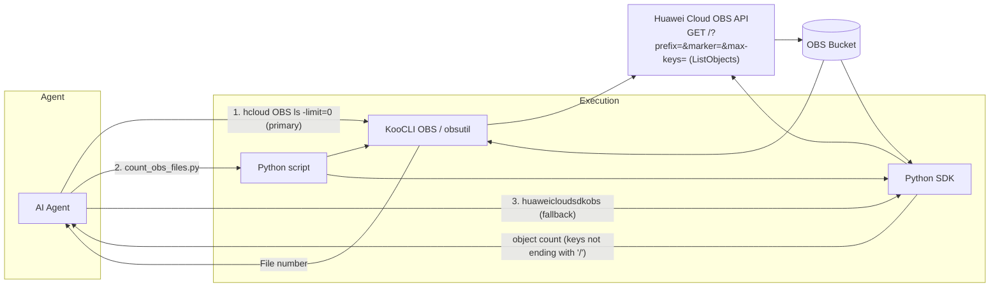
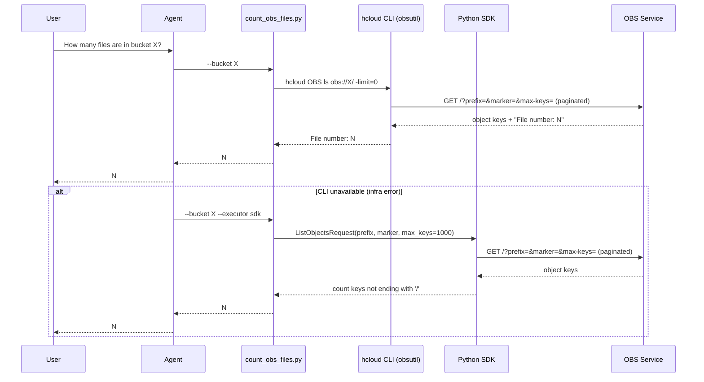

# Data Flow Diagram

## Architecture Overview

```mermaid
graph LR
    subgraph Agent
        A[AI Agent]
    end
    subgraph Execution
        A -->|"1. hcloud OBS ls -limit=0 (primary)"| B[KooCLI OBS / obsutil]
        A -->|"2. count_obs_files.py"| P[Python script]
        A -->|"3. huaweicloudsdkobs (fallback)"| C[Python SDK]
    end
    B --> D["Huawei Cloud OBS API<br/>GET /?prefix=&marker=&max-keys= (ListObjects)"]
    C --> D
    P --> B
    P --> C
    D --> E[(OBS Bucket)]
    E --> B
    E --> C
    B -->|"File number"| A
    C -->|"object count (keys not ending with '/')"| A
```

## Sequence Diagram

```mermaid
sequenceDiagram
    participant U as User
    participant A as Agent
    participant P as count_obs_files.py
    participant C as hcloud CLI (obsutil)
    participant S as Python SDK
    participant O as OBS Service

    U->>A: How many files are in bucket X?
    A->>P: --bucket X
    P->>C: hcloud OBS ls obs://X/ -limit=0
    C->>O: GET /?prefix=&marker=&max-keys= (paginated)
    O-->>C: object keys + "File number: N"
    C-->>P: File number: N
    P-->>A: N
    A-->>U: N

    alt CLI unavailable (infra error)
        A->>P: --bucket X --executor sdk
        P->>S: ListObjectsRequest(prefix, marker, max_keys=1000)
        S->>O: GET /?prefix=&marker=&max-keys= (paginated)
        O-->>S: object keys
        S-->>P: count keys not ending with '/'
        P-->>A: N
        A-->>U: N
    end
```
