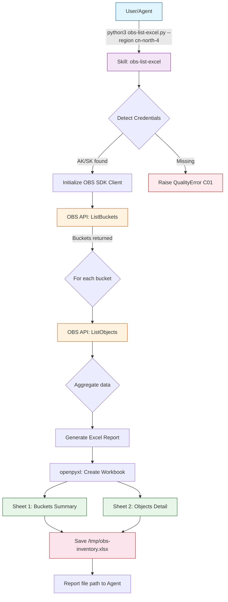

# Data Flow Diagram

## Flow Description

1. **Trigger**: User or agent invokes the skill with a region parameter
2. **Auth**: Credentials auto-detected from environment variables
3. **List Buckets**: SDK `list_buckets()` → `GET /` returns all OBS buckets
4. **List Objects**: For each bucket, SDK `list_objects()` → `GET /` with pagination
5. **Excel Generation**: `openpyxl` creates a workbook with two sheets:
   - **Buckets Summary**: Bucket name, creation date, location, object count, total size
   - **Objects**: Bucket name, object key, size, ETag, last modified, storage class
6. **Output**: Excel file saved at the specified output path