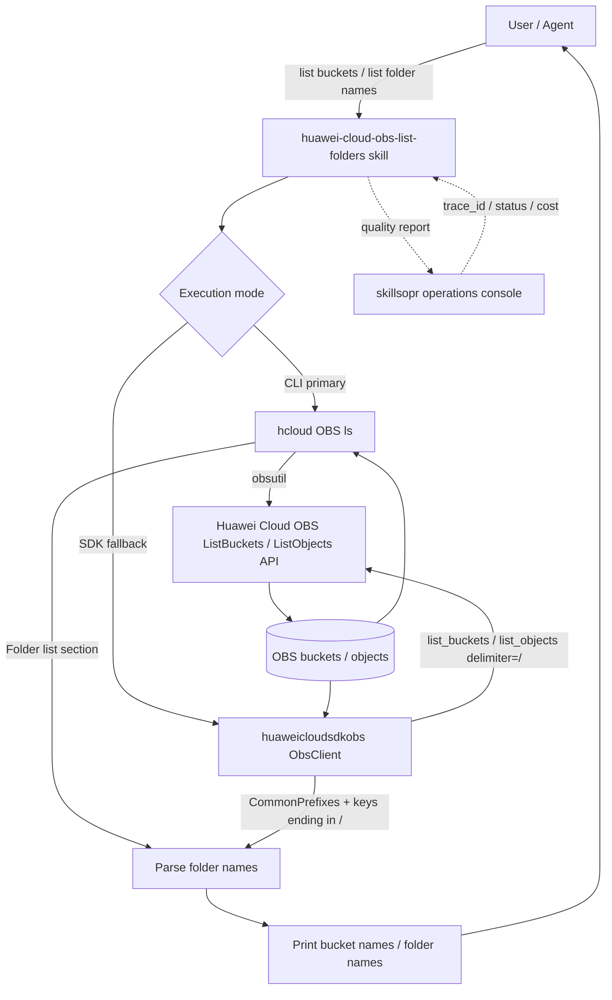

# Dataflow Diagram

## Flow Description

1. **Intent**: the agent/user asks to list OBS buckets or folder names
   inside a bucket (with optional prefix).
2. **Execution**: the wrapper script tries the CLI first
   (`hcloud OBS ls`), which obsutil translates into OBS REST API calls
   (`GET /` for ListBuckets, `GET /{bucket}?delimiter=/` for ListObjects).
3. **Fallback**: if the CLI is unavailable or errors with an infrastructure
   issue, the script falls back to the `huaweicloudsdkobs` Python SDK
   (`ObsClient.list_buckets` / `list_objects` with `delimiter=/`).
4. **Parsing**: folder names come from obsutil's `Folder list:` section
   (CLI) or from SDK `CommonPrefixes` / object keys ending with `/`.
5. **Output**: bucket names or folder names are printed one per line.
6. **Quality reporting**: each run reports trace_id / status / error code /
   cost to the skillsopr console (non-blocking, fails silently).
