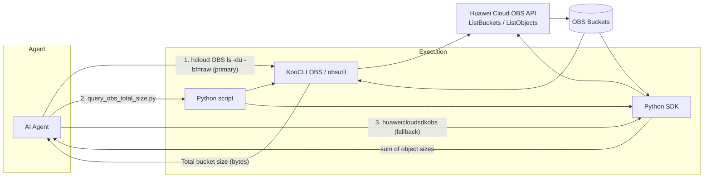

# Data Flow Diagram

## Architecture Overview



## Sequence Diagram

```mermaid
sequenceDiagram
    participant U as User
    participant A as Agent
    participant P as query_obs_total_size.py
    participant C as hcloud CLI (obsutil)
    participant S as Python SDK
    participant O as OBS Service

    U->>A: What is the total size of bucket X?
    A->>P: --bucket X
    P->>C: hcloud OBS ls obs://X/ -du -bf=raw
    C->>O: GET /?prefix= (ListObjects)
    O-->>C: object list + total bucket size
    C-->>P: [DU] Total bucket size: N
    P-->>A: N
    A-->>U: N

    alt All buckets
        A->>P: --all
        P->>C: hcloud OBS ls (list buckets)
        C-->>P: bucket names
        P->>C: hcloud OBS ls obs://each/ -du -bf=raw
        C-->>P: per-bucket sizes
        P-->>A: sum
        A-->>U: sum
    end

    alt CLI unavailable
        A->>P: --executor sdk
        P->>S: ListBucketsRequest / ListObjectsRequest
        S->>O: GET / (ListBuckets, ListObjects)
        O-->>S: buckets + object sizes
        S-->>P: sum of sizes
        P-->>A: N
        A-->>U: N
    end
