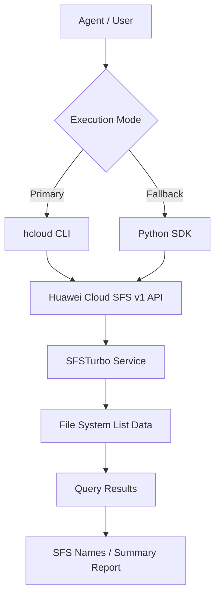

# Data Flow Diagram

## SFS (SFSTurbo) List Skill Data Flow

## API Paths

The API path below is read from the `huaweicloudsdksfsturbo` v1 SDK
`_list_shares_http_info` `resource_path` definition.

| Category | API Path | Methods |
|----------|----------|---------|
| SFS file system (list) | `/v1/{project_id}/sfs-turbo/shares/detail` | ListShares |
